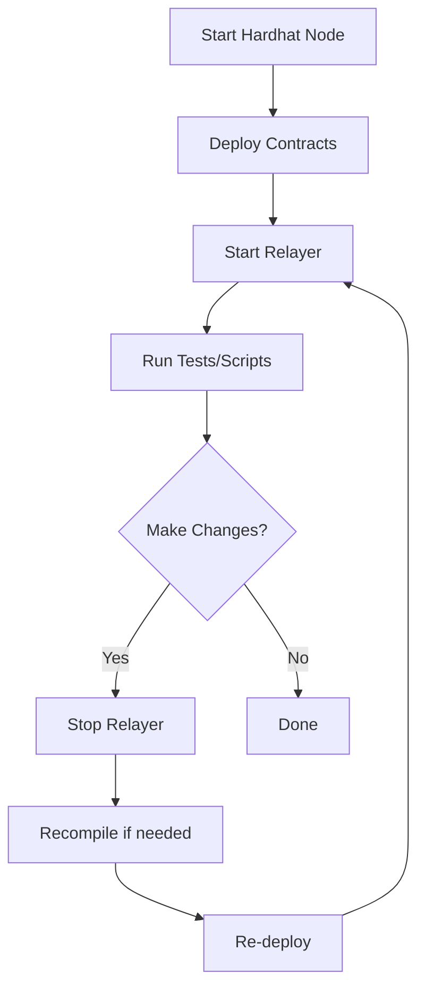

# Local Development Guide

This guide covers setting up your local development environment for the Confidential Word Game, including both mock mode (Docker) and real fhEVM mode.

## Table of Contents

- [Prerequisites](#prerequisites)
- [Option 1: Docker Setup (Recommended for Beginners)](#option-1-docker-setup-recommended-for-beginners)
- [Option 2: Manual Local Setup](#option-2-manual-local-setup)
- [Option 3: Real fhEVM Devnet](#option-3-real-fhevm-devnet)
- [Development Workflows](#development-workflows)
- [Troubleshooting](#troubleshooting)

## Prerequisites

### Required Software

- **Node.js** >= 18.0.0
  ```bash
  node --version  # Should be v18.x or higher
  ```

- **npm** or **yarn**
  ```bash
  npm --version  # Should be 9.x or higher
  ```

- **Git**
  ```bash
  git --version
  ```

### Optional (for Docker setup)

- **Docker** >= 20.10.0
  ```bash
  docker --version
  ```

- **Docker Compose** >= 2.0.0
  ```bash
  docker-compose --version
  ```

### Installation

```bash
# Clone repository
git clone https://github.com/your-org/confidential-word-game.git
cd confidential-word-game

# Install dependencies
npm install

# Copy environment file
cp .env.example .env

# Compile contracts
npm run compile
```

---

## Option 1: Docker Setup (Recommended for Beginners)

**Best for:** Quick start, no configuration needed, instant feedback

### Advantages

✅ No manual setup required
✅ All services pre-configured
✅ Consistent environment
✅ Works out-of-the-box

### Quick Start

```bash
# Start all services (Hardhat, Gateway, Relayer)
docker-compose up

# In another terminal, check status
docker-compose ps

# View logs
docker-compose logs -f relayer
```

### What Gets Started

1. **Hardhat Node** - Local Ethereum network (port 8545)
2. **Mock Gateway** - Simulated FHE Gateway (port 7077)
3. **Contract Deployer** - Automatically deploys contracts
4. **Relayer** - Manages game operations

### Using the Docker Environment

#### Get Deployed Contract Address

```bash
# From deployer logs
docker-compose logs deployer | grep "Contract deployed"

# Example output:
# Contract deployed to: 0x5FbDB2315678afecb367f032d93F642f64180aa3
```

#### Run Tests Against Docker

```bash
# Set contract address (from above)
export GAME_CONTRACT_ADDRESS=0x5FbDB2315678afecb367f032d93F642f64180aa3

# Run integration tests
npm test

# Watch events
npm run events:listen

# Monitor games
npm run events:monitor
```

#### Interact with Contracts

```javascript
// In another script or console
const { ethers } = require('hardhat');

async function main() {
  const contract = await ethers.getContractAt(
    'ConfidentialWordGame',
    '0x5FbDB2315678afecb367f032d93F642f64180aa3'
  );

  // Create room
  const tx = await contract.createRoom('Alice');
  await tx.wait();

  console.log('Room created!');
}

main();
```

#### Stop Services

```bash
# Stop (keeps data)
docker-compose stop

# Stop and remove containers
docker-compose down

# Remove everything including volumes
docker-compose down -v
```

### Docker Development Workflow

```bash
# 1. Start services
docker-compose up -d

# 2. Make code changes
# Edit contracts, scripts, etc.

# 3. Restart specific service
docker-compose restart relayer

# 4. View logs
docker-compose logs -f relayer

# 5. Run tests
npm test

# 6. Stop when done
docker-compose down
```

---

## Option 2: Manual Local Setup

**Best for:** Full control, customization, debugging

### Advantages

✅ Fine-grained control
✅ Easier debugging
✅ No Docker overhead
✅ Direct access to logs

### Step 1: Start Hardhat Node

```bash
# Terminal 1
npm run node

# Output:
# Started HTTP and WebSocket JSON-RPC server at http://127.0.0.1:8545/
#
# Accounts:
# 0xf39Fd6e51aad88F6F4ce6aB8827279cffFb92266 (10000 ETH)
# ...
```

**Keep this terminal running.**

### Step 2: Deploy Contracts

```bash
# Terminal 2
npm run deploy:local

# Output:
# Deploying contracts...
# Contract deployed to: 0x5FbDB2315678afecb367f032d93F642f64180aa3
```

**Copy the contract address.**

### Step 3: Start Relayer

```bash
# Terminal 3
export GAME_CONTRACT_ADDRESS=0x5FbDB2315678afecb367f032d93F642f64180aa3
npm run relayer

# Output:
# 🔧 Initializing relayer...
# ⚠️ Continuing without FHE (for local testing)
# 🎮 Monitoring rooms for game start...
```

**Keep this terminal running.**

### Step 4: Interact

```bash
# Terminal 4
npm test

# Or use the SDK
node scripts/example-game-flow.js

# Or monitor events
npm run events:listen
```

### Manual Development Workflow



---

## Option 3: Real fhEVM Devnet

**Best for:** Production-like testing, real FHE operations

### Advantages

✅ Real FHE encryption
✅ Real Gateway callbacks
✅ Production-ready testing
✅ Full privacy guarantees

### Prerequisites

1. **Zama Devnet Access**
   - RPC URL: https://devnet.zama.ai
   - Gateway URL: https://gateway.devnet.zama.ai

2. **Testnet Tokens**
   - Visit: https://faucet.zama.ai
   - Request tokens for your deployer address

3. **Funded Account**
   ```bash
   # Generate or use existing account
   # Make sure it has testnet ETH
   ```

### Step 1: Configure Environment

```bash
# Edit .env file
nano .env
```

Add:

```bash
# Network Configuration
ZAMA_DEVNET_RPC_URL=https://devnet.zama.ai
GATEWAY_URL=https://gateway.devnet.zama.ai

# Your deployer private key (KEEP SECRET!)
PRIVATE_KEY=0x1234567890abcdef...

# After deployment
GAME_CONTRACT_ADDRESS=
```

### Step 2: Get Testnet Tokens

```bash
# Visit faucet
open https://faucet.zama.ai

# Enter your address
# Wait for tokens to arrive

# Check balance
npx hardhat run scripts/check-balance.js --network zamaDevnet
```

### Step 3: Deploy to Devnet

```bash
npm run deploy:zama

# Output:
# Deploying to Zama devnet...
# Contract deployed to: 0x742d35Cc6634C0532925a3b844Bc9e7595f0bEb4
# Transaction hash: 0xabcd...
```

**Important:** Copy the contract address to `.env`:

```bash
GAME_CONTRACT_ADDRESS=0x742d35Cc6634C0532925a3b844Bc9e7595f0bEb4
```

### Step 4: Start Relayer on Devnet

```bash
npm run relayer

# Output:
# 🔧 Initializing relayer...
# 🔐 Initializing FHE instance...
# ✅ FHE instance initialized  # <-- Real FHE!
# 🎮 Monitoring rooms for game start...
```

### Step 5: Interact with Devnet

```javascript
// scripts/interact-devnet.js
const { ethers } = require('hardhat');
const { createFhevmInstance } = require('fhevmjs');

async function main() {
  // Connect to devnet
  const contract = await ethers.getContractAt(
    'ConfidentialWordGame',
    process.env.GAME_CONTRACT_ADDRESS
  );

  // Initialize FHE
  const fhevmInstance = await createFhevmInstance({
    chainId: 9000, // Zama devnet
    networkUrl: process.env.ZAMA_DEVNET_RPC_URL,
    gatewayUrl: process.env.GATEWAY_URL,
  });

  // Encrypt balance
  const amount = 1000;
  const encryptedAmount = fhevmInstance.encrypt32(amount);

  // Deposit
  const tx = await contract.depositBalance(
    encryptedAmount.data,
    encryptedAmount.proof
  );
  await tx.wait();

  console.log('✅ Balance deposited with real FHE encryption!');
}

main();
```

### Monitoring Devnet

```bash
# Watch events
npm run events:listen

# Monitor games
npm run events:monitor

# Check block explorer
open https://explorer.zama.ai/address/<your-contract>
```

---

## Development Workflows

### Workflow 1: Feature Development

Use **Docker** for rapid iteration:

```bash
# 1. Start Docker
docker-compose up -d

# 2. Make changes to contract
vim contracts/ConfidentialWordGame.sol

# 3. Recompile
npm run compile

# 4. Restart Docker (will re-deploy)
docker-compose restart deployer

# 5. Test
npm test
```

### Workflow 2: FHE Testing

Use **Real Devnet** for FHE validation:

```bash
# 1. Deploy to devnet
npm run deploy:zama

# 2. Test real FHE operations
npm run test:fhe

# 3. Monitor behavior
npm run events:monitor

# 4. Debug issues
docker-compose logs -f gateway
```

### Workflow 3: Integration Testing

Use **Manual Setup** for full control:

```bash
# Terminal 1: Hardhat
npm run node

# Terminal 2: Deploy
npm run deploy:local

# Terminal 3: Relayer
GAME_CONTRACT_ADDRESS=0x... npm run relayer

# Terminal 4: Event listener
GAME_CONTRACT_ADDRESS=0x... npm run events:listen

# Terminal 5: Game monitor
GAME_CONTRACT_ADDRESS=0x... npm run events:monitor

# Terminal 6: Tests
npm test
```

---

## Troubleshooting

### Problem: Docker services won't start

```bash
# Check ports
lsof -i :8545  # Should be free
lsof -i :7077  # Should be free

# Kill conflicting processes
kill -9 <PID>

# Force recreate
docker-compose down -v
docker-compose up --force-recreate
```

### Problem: "Failed to initialize FHE instance"

**Local Mode:**
- Omit `GATEWAY_URL` or set to empty string
- Relayer will use mock mode

**Devnet Mode:**
- Verify `GATEWAY_URL=https://gateway.devnet.zama.ai`
- Check network connectivity:
  ```bash
  curl https://gateway.devnet.zama.ai/health
  ```

### Problem: "Insufficient funds for gas"

```bash
# Check balance
npx hardhat run scripts/check-balance.js --network zamaDevnet

# Get more tokens
open https://faucet.zama.ai

# Wait 30 seconds, check again
```

### Problem: Contracts not deploying

```bash
# Check Hardhat node is running
curl http://localhost:8545

# Check network in hardhat.config.js
npm run compile  # Recompile

# Try deploying manually
npx hardhat run scripts/deploy.js --network localhost
```

### Problem: Relayer not starting games

**Checklist:**
- [ ] Are there 2+ players in room?
- [ ] Do players have balances?
- [ ] Is relayer address authorized?
  ```bash
  npx hardhat console --network localhost
  > const contract = await ethers.getContractAt("ConfidentialWordGame", "0x...")
  > await contract.relayer()
  ```

### Problem: Gateway timeouts

**Local (Mock):**
- Mock gateway should respond instantly
- Check `docker-compose logs mock-gateway`

**Devnet:**
- Real gateway may take 10-30 seconds
- Monitor with `npm run events:listen`
- Be patient, callbacks are async

### Problem: Events not appearing

```bash
# Check contract address is correct
echo $GAME_CONTRACT_ADDRESS

# Verify contract is deployed
npx hardhat verify --network localhost <address>

# Check event listener logs
DEBUG=* npm run events:listen
```

---

## Best Practices

### For Local Development

- ✅ Use Docker for quick iterations
- ✅ Use manual setup for debugging
- ✅ Keep terminals organized (label them)
- ✅ Monitor events in separate terminal
- ✅ Commit often, test frequently

### For Devnet Testing

- ✅ Test FHE operations thoroughly
- ✅ Monitor gas usage
- ✅ Check Gateway callback timings
- ✅ Verify privacy guarantees
- ✅ Document any issues

### For All Environments

- ✅ Never commit private keys
- ✅ Use .env for configuration
- ✅ Write tests before implementing
- ✅ Log everything during development
- ✅ Ask for help when stuck

---

## Additional Resources

- [Zama fhEVM Documentation](https://docs.zama.ai/fhevm)
- [Hardhat Documentation](https://hardhat.org/docs)
- [Docker Compose Documentation](https://docs.docker.com/compose/)
- [Project README](../README.md)
- [Contributing Guide](../CONTRIBUTING.md)

---

## Getting Help

- 📖 Documentation: Check README.md and this guide
- 💬 Discord: Join the community (link in README)
- 🐛 Issues: Report bugs on GitHub
- 📧 Email: security@your-domain.com

---

**Happy Developing! 🎮🔐**

Remember: Local development with Docker is for testing only. Always test on real fhEVM before production deployment!
